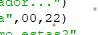
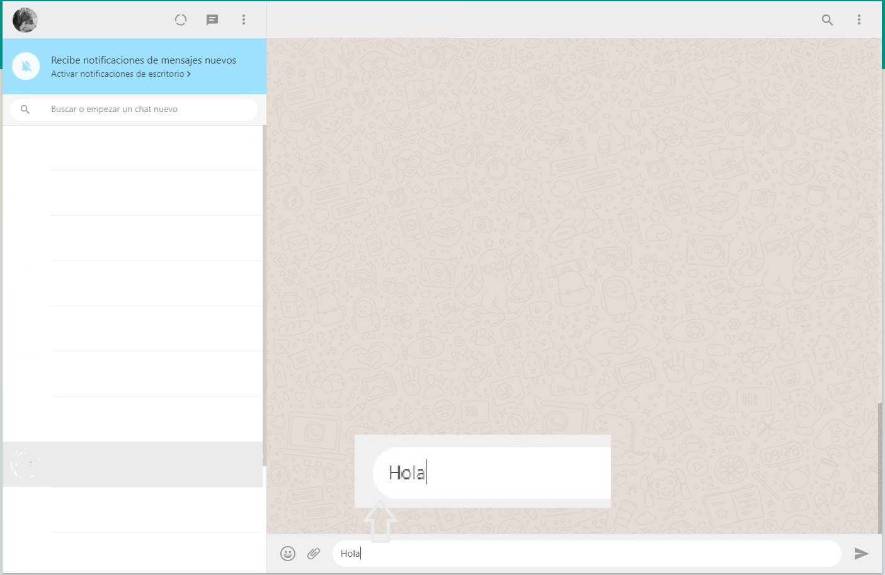

como instalar

1. Tener instalado python.

2. Instalar el paquete para la automatizacion de WhatsApp

```bash
	pip install phywhatkit
```

3. Crear un archivo llamado main.py y escribir el siguiente código

```py
import pywhatkit

try: 
  #enviara el mensaje
  print("Esperando WhatsApp web en el navegador...")
  pywhatkit.sendwhatmsg("+59XXXXXXXXX","Hola",00,22)
  pywhatkit.sendwhatmsg("+59XXXXXXXXX","¿Cómo estas?",00,23)
  print("Mensaje Enviado.")
 
except: 
 
  print("Error al enviar mensaje.")
```

4. Ejecutar el comando
	
```bash
	python main.py
```
4.1. En el código se programa la hora y minuto, en terminal se muestra en cuantos segundos se enviará

<p><kbd></kbd></p>

4.2. Se abrirá automaticamente el navegador con la pagina https://web.whatsapp.com/

<p><kbd></kbd></p>

4.3. Presionar enter para enviar el mensaje

